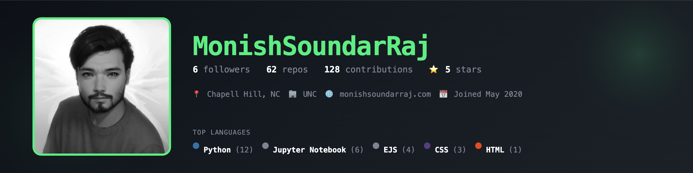

```
          $$\   $$\           $$\ $$\           $$\       $$\   $$\ $$\                             $$\                     
          $$ |  $$ |          $$ |$$ |          $$ |      $$$\  $$ |\__|                            $$ |                    
          $$ |  $$ | $$$$$$\  $$ |$$ | $$$$$$\  $$ |      $$$$\ $$ |$$\  $$$$$$$\  $$$$$$\        $$$$$$\    $$$$$$\        
          $$$$$$$$ |$$  __$$\ $$ |$$ |$$  __$$\ $$ |      $$ $$\$$ |$$ |$$  _____|$$  __$$\       \_$$  _|  $$  __$$\       
          $$  __$$ |$$$$$$$$ |$$ |$$ |$$ /  $$ |\__|      $$ \$$$$ |$$ |$$ /      $$$$$$$$ |        $$ |    $$ /  $$ |      
          $$ |  $$ |$$   ____|$$ |$$ |$$ |  $$ |          $$ |\$$$ |$$ |$$ |      $$   ____|        $$ |$$\ $$ |  $$ |      
          $$ |  $$ |\$$$$$$$\ $$ |$$ |\$$$$$$  |$$\       $$ | \$$ |$$ |\$$$$$$$\ \$$$$$$$\         \$$$$  |\$$$$$$  |      
          \__|  \__| \_______|\__|\__| \______/ \__|      \__|  \__|\__| \_______| \_______|         \____/  \______/       
                                                                                                                            
                                                                                                                            
                                                                                                                            
                                              $$\                                                                           
                                              $$ |                                                                          
          $$$$$$\$$$$\   $$$$$$\   $$$$$$\  $$$$$$\         $$\   $$\  $$$$$$\  $$\   $$\                                   
          $$  _$$  _$$\ $$  __$$\ $$  __$$\ \_$$  _|        $$ |  $$ |$$  __$$\ $$ |  $$ |                                  
          $$ / $$ / $$ |$$$$$$$$ |$$$$$$$$ |  $$ |          $$ |  $$ |$$ /  $$ |$$ |  $$ |                                  
          $$ | $$ | $$ |$$   ____|$$   ____|  $$ |$$\       $$ |  $$ |$$ |  $$ |$$ |  $$ |                                  
          $$ | $$ | $$ |\$$$$$$$\ \$$$$$$$\   \$$$$  |      \$$$$$$$ |\$$$$$$  |\$$$$$$  |                                  
          \__| \__| \__| \_______| \_______|   \____/        \____$$ | \______/  \______/                                   
                                                            $$\   $$ |                                                      
                                                            \$$$$$$  |                                                      
                                                             \______/     
```

<div align="center">
          
[](https://git.io/typing-svg)

[](https://github.com/monishsoundarraj)
[](https://linkedin.com/in/monish-soundar-raj-613207218)
[](https://monishsoundarraj.github.io/personal-portfolio/)
[](mailto:msoundar@uncc.edu)

</div>

## 💻 Tech Stack

<div align="center">


</div>

</div>

## 📊 GitHub Stats
<div align="center">

</div>
---

<div align="center">
  <h3>💭 Quote of the Day</h3>
  
</div>

<div align="center">
  
  [](https://github.com/monishsoundarraj)
  

</div>


